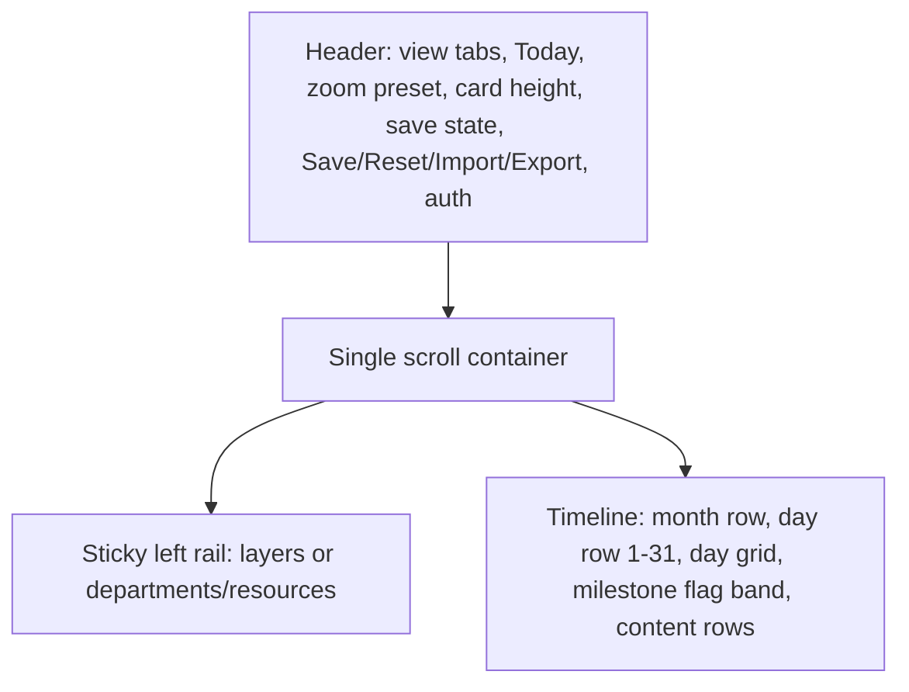

## Stack and setup

- Next.js (App Router) + TypeScript + Tailwind CSS, client-rendered timeline (`"use client"`), Zustand for state.
- `netlify.toml` with `@netlify/plugin-nextjs`; runs locally via `npm run dev`.
- Secrets in `.env.local` (gitignored) with a committed `.env.local.example`. Firebase is initialized lazily and only when all `NEXT_PUBLIC_FIREBASE_*` vars are present, so the app fully works without it.

## Data model = the provided JSON, verbatim

[Context/project_state_2026-09-30.json](Context/project_state_2026-09-30.json) is the canonical save format. `lib/types.ts` mirrors it exactly: `layers`, `tasks`, `milestones`, `departments`, `resources`, `priorityMarks`.

Key derived rules read out of that file:
- Visible/hidden ordering: render `isHidden === false` sorted by `order`, then hidden ones sorted by `order`. The JSON's visible layers are `order` 30/40/50/60 and hidden are 0/10/20/70/80, which reproduces the screenshot order and satisfies "hidden goes to the end, unhide restores position".
- A task's per-assignee window is `startDate + assignee.startOffsetDays` for `assignee.durationDays` (see `task-1790240552526` Winter LE: offset 12, 38d inside a 50d task).
- `assigneeIds` is redundant with `assignees`; keep both in sync on write, and on import rebuild `assigneeIds` from `assignees`.
- Colors are Tailwind-style tokens (`purple-500`, `white`, `stone-500`) and `priorityMarks.color` carries a `bg-` prefix. Because dynamic Tailwind classes get purged, `lib/palette.ts` maps the 20 palette tokens to hex and all bars/flags/dots use inline styles from that map. Unknown tokens fall back to a neutral gray.

## Import / export / persistence

- `lib/schema.ts`: tolerant normalizer (zod) that accepts the file as-is, fills defaults (`percentage: 100`, `startOffsetDays: 0`, `durationDays: task duration - offset`, missing `order` by array index), drops orphan references, and returns a fully-formed state. Import sets the timeline horizon from the data and re-centers Today.
- `lib/storage.ts`: debounced localStorage autosave feeding the header's `Saved to Storage HH:MM:SS` badge; `Reset` clears to an empty project.
- Export downloads pretty-printed JSON named `project_state_YYYY-MM-DD.json`. `Save` writes the same JSON to Firestore when configured, otherwise flushes to storage and says so.

## Layout

One scroll container with a `position: sticky; left: 0` rail keeps vertical/horizontal scroll in sync for free. Day columns are absolutely positioned off `dayIndex * dayWidth`, so header days, grid lines, weekday shading, task bars, and milestone lines can never drift apart.

## Core geometry (`lib/layout.ts`)

- `dayIndex(date)` against the horizon start; horizon = min/max of all task and milestone dates padded to whole months.
- Task stacking: greedy row packing per layer by start date; layer height = `rows * (cardHeight + gap)` with a floor so the name and command buttons stay visible at small card heights.
- Milestone flag packing: interval packing using estimated flag pixel widths, with the Today flag participating; the milestone band grows by row count (the JSON's overlapping 2026-10-21/10-22 and 11-07/11-08 milestones exercise this).
- Dual zoom: `dayWidth` from presets (Year / Quarter / Compact / Standard / Detailed / Expanded) times a zoom percentage, and `cardHeight` (18-60px) stepped independently. No wheel-zoom shortcut.

## Interaction

- Drag a bar horizontally to move (snaps to whole days), drag its right edge to resize. In Roadmap view this writes `startDate` / `durationDays`; in Resources view it writes that assignee's `startOffsetDays` / `durationDays`.
- Every layer, task, department, and resource has one compact command cluster (Add / Edit / Move up / Move down / Info / Delete / Hide).
- All create and edit flows use one centered modal component. The task modal includes the assignee scheduling table (allocation %, start offset, duration, live computed calendar start/end) plus the miniature timeline preview showing each assignee's slice of the task.
- Resource bars render the allocation split: top `percentage` in the layer color, bottom remainder as a diagonal cross-hatch (`repeating-linear-gradient` at +/-45deg with a divider), with the `80%` badge and `Day 0-30 of 45d` label seen in the screenshot.

## Phases

Phase 1 ships a usable Roadmap view that round-trips the provided JSON; Phase 2 adds the Resources view; Phase 3 is zoom/hide/reorder polish and optional Firebase.
